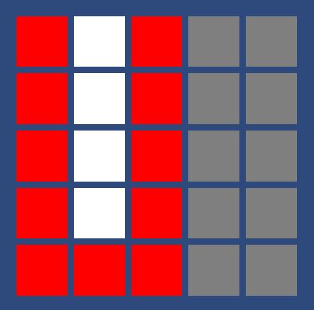

# 2D Pathfinding in Unity

- Learning how to write a pathfinding algorithm on Unity
- Learn to visualize pathfinding on a 2D grid

- [Check out the Demo on Unity](https://youtu.be/siYMawmwk1I)

## The Grid Layout

## The Wall (Obsticle)

## A Sample Pathway

## Pathway Varies

